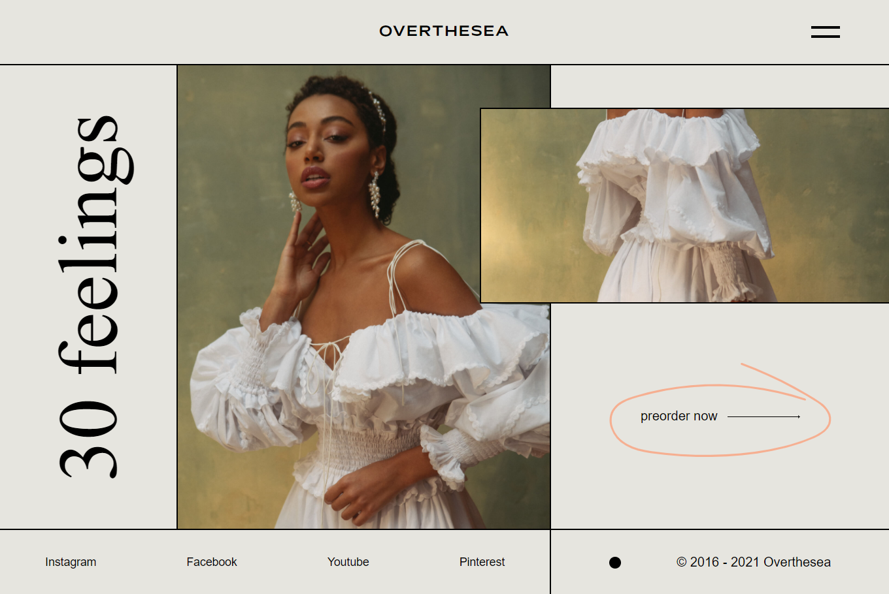

# Challenge Overthesea

Challenge lancé par [Benjamin Code](https://www.youtube.com/watch?v=uzcaGkJWBXk) pour l'intégration d'une maquette.

Ce challenge m'a permis de teste ViteJS pour générer mon code Sass ainsi que de travailler avec les grids CSS.

## Contact

Github : https://github.com/Gon3s

Twitter : https://twitter.com/Cuoq_Kevin
